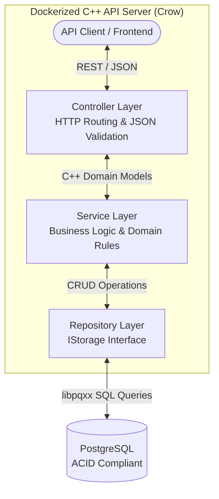
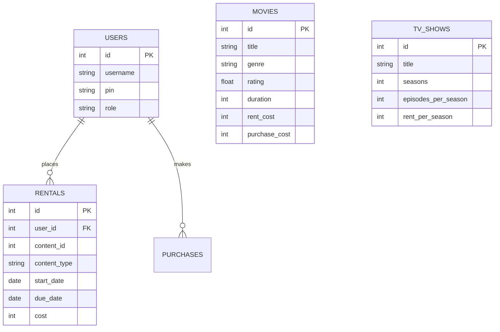

<div align="center">
  <h1>Netflix Inventory API</h1>
  
  <p><b>If you find this project useful, please consider giving it a ⭐ Star on GitHub!</b></p>
  
  
  
  
  
</div>

<br/>

A scalable, production-ready RESTful API for managing a Netflix-style streaming catalog. Built entirely in C++20, this system handles concurrent user authentication, content browsing, and stateful rental transactions while ensuring strict memory safety and ACID-compliant database operations.

---

## System Architecture

The application strictly adheres to the **Controller-Service-Repository** pattern, entirely decoupling HTTP routing logic from core business rules and database operations.



---

## Key Features

- **Memory Safety via RAII:** Eliminates memory leaks and undefined behavior by enforcing strict modern C++ RAII principles and `std::shared_ptr` ownership models.
- **SOLID Design:** Designed with a highly extensible, interface-driven codebase. New subscription models or content types can be injected without modifying underlying routing or database layers.
- **Polymorphic Domain Model:** Utilizes virtual base classes to efficiently manage varying content types (Movies, TV Shows) under a unified system.
- **Persistent Transactions:** Integrates PostgreSQL via a custom repository interface to guarantee stateful, ACID-compliant concurrency.
- **Dockerized Deployment:** Standardized build and deployment pipeline using CMake and Docker Compose.

---

## Getting Started

### Prerequisites
- Docker Desktop or Docker Engine + Docker Compose

### Build and Run

1. **Clone the repository:**
   ```bash
   git clone https://github.com/CODER-7777/Netflix_Inventory_API.git
   cd Netflix_Inventory_API
   ```

2. **Boot the cluster:**
   ```bash
   docker compose up --build
   ```
   *This command automatically initializes the PostgreSQL database with the required schema and compiles the C++ REST API.*

3. **Access the API:**
   The API will be live at `http://localhost:8080`.

---

## API Usage & Commands

Since this is a headless REST API, you can interact with it using tools like **Postman**, **Thunder Client**, or simply use the `curl` commands provided below in a separate terminal.

### 1. Authentication

**Register a new user:**
```bash
curl -X POST http://localhost:8080/api/register \
     -H "Content-Type: application/json" \
     -d '{"username": "vivek", "pin": "1234"}'
```

**Login to an account:**
```bash
curl -X POST http://localhost:8080/api/login \
     -H "Content-Type: application/json" \
     -d '{"username": "vivek", "pin": "1234"}'
```

### 2. Catalog Management

**Add a new Movie (Admin):**
```bash
curl -X POST http://localhost:8080/api/movies \
     -H "Content-Type: application/json" \
     -d '{
           "title": "Inception",
           "genre": "Sci-Fi",
           "rating": 8.8,
           "duration": 148,
           "rent_cost": 149,
           "purchase_cost": 299
         }'
```

**View the entire Movie Catalog:**
```bash
curl -X GET http://localhost:8080/api/movies
```

**Search for a specific Movie:**
```bash
curl -X GET "http://localhost:8080/api/movies?search=Sci-Fi"
```

### 3. Transactions (Rent & Buy)

**Rent a Movie:**
```bash
curl -X POST http://localhost:8080/api/rentals \
     -H "Content-Type: application/json" \
     -d '{
           "user_id": 1,
           "content_id": 1,
           "content_type": "MOVIE",
           "months": 3,
           "monthly_cost": 149
         }'
```

**Purchase a Movie:**
```bash
curl -X POST http://localhost:8080/api/purchases \
     -H "Content-Type: application/json" \
     -d '{
           "user_id": 1,
           "content_id": 1,
           "content_type": "MOVIE",
           "cost": 299
         }'
```

### 4. User Dashboard

**View your Dashboard (Total Charges, Active Rentals, Purchases):**
Replace `1` with the actual User ID returned during login.
```bash
curl -X GET http://localhost:8080/api/users/1/dashboard
```

**Return a Rented Movie:**
Replace `1` with the specific Rental ID returned in your dashboard.
```bash
curl -X DELETE http://localhost:8080/api/rentals/1
```

---

## Database Schema

The system uses a relational PostgreSQL schema to enforce data integrity across user authentication and rental tracking.


